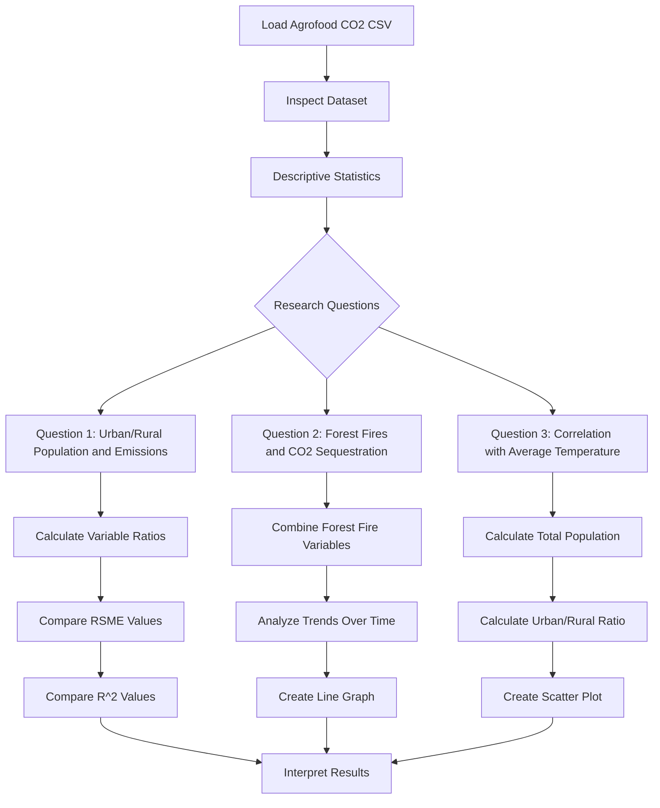

# IDS 706 Week 2 Assignment

This project is for the IDS 706 Data Engineering course Week 2 assignment, "Start Your First Data Analysis."

The dataset in [Agrofood_co2_emission.csv](Agrofood_co2_emission.csv) was downloaded from Kaggle on 8 September 2026. The analysis and notes are in [assignment_2_ntbk.ipynb](assignment_2_ntbk.ipynb).

The first code block imports pandas, matplotlib, reads the CSV file, and provides options for examining its structure. The `.describe()` results are especially useful for this analysis.

## Dataset Features

As of September 9, 2026, this dataset contains fewer than 7,000 entries.

**Savanna fires**: Emissions from fires in savanna ecosystems.  
**Forest fires**: Emissions from fires in forested areas.  
**Crop Residues**: Emissions from burning or decomposing leftover plant material after crop harvesting.  
**Rice Cultivation**: Emissions from methane released during rice cultivation.  
**Drained organic soils (CO2)**: Emissions from carbon dioxide released when draining organic soils.  
**Pesticides Manufacturing**: Emissions from the production of pesticides.  
**Food Transport**: Emissions from transporting food products.  
**Forestland**: Land covered by forests.  
**Net Forest conversion**: Change in forest area due to deforestation and afforestation.  
**Food Household Consumption**: Emissions from food consumption at the household level.  
**Food Retail**: Emissions from the operation of retail establishments selling food.  
**On-farm Electricity Use**: Electricity consumption on farms.  
**Food Packaging**: Emissions from the production and disposal of food packaging materials.  
**Agrifood Systems Waste Disposal**: Emissions from waste disposal in the agrifood system.  
**Food Processing**: Emissions from processing food products.  
**Fertilizers Manufacturing**: Emissions from the production of fertilizers.  
**IPPU**: Emissions from industrial processes and product use.  
**Manure applied to Soils**: Emissions from applying animal manure to agricultural soils.  
**Manure left on Pasture**: Emissions from animal manure on pasture or grazing land.  
**Manure Management**: Emissions from managing and treating animal manure.  
**Fires in organic soils**: Emissions from fires in organic soils.  
**Fires in humid tropical forests**: Emissions from fires in humid tropical forests.  
**On-farm energy use**: Energy consumption on farms.  
**Rural population**: Number of people living in rural areas.  
**Urban population**: Number of people living in urban areas.  
**Total Population - Male**: Total number of male individuals in the population.  
**Total Population - Female**: Total number of female individuals in the population.  
**total_emission**: Total greenhouse gas emissions from various sources.  
**Average Temperature (degrees C)**: The average annual temperature in degrees Celsius.

## Research Questions

1. **Did forest fires affect a forest's future ability to sequester CO2?**

   This question will examine **Forest fires** and **Fires in humid tropical forests** over time, along with changes in `total_emission`.

2. **Does the ratio of urban to rural populations affect total emissions?**

   I will normalize `total_emission` by the sum of the total male and total female populations. I will also compare rural and urban population counts with male and female population counts and discuss how any differences may affect the results.

3. **Which variable has the strongest correlation with average temperature?**

   This question may lead to additional routes for investigation. A location's temperature may be influenced by activities outside the area, but this is a useful starting point.

These three questions provide a reasonable starting point for the analysis.

## Analysis Plan

### Question 1: Did forest fires affect a forest's future ability to sequester CO2?

Sum `Forest fires` and `Fires in humid tropical forests` for the United States of America.  
Create a line graph to compare the shapes of the trends over time for designated areas.

My initial intention was to just do the USA, but I decided to also include Greece.

### Question 2: Does the ratio of urban to rural populations affect total emissions?

Sum `Total Population - Male` and `Total Population - Female`.
Divide `total_emission` by the population sum.
Divide `Urban population` by `Rural population`.
Create a scatter plot of population ratio versus normalized emissions.

### Question 3: Which variable has the strongest correlation with average temperature?
A regression analysis for each `Area` and `Year` will consist of running 4 models and then keeping the model with the lowest RMSE value.

Then, we will sort the dataframe according to the R-squared values (in decending order) to determine which variable should be considered for further investigation.

*Note: I will not generate plots for this metric because it requires many comparisons.*

## Analysis Workflow

*mermaid chart generated using AI*

## Helpful Definitions

- **Afforestation**: An activity leading to the creation of forest on land that was not previously forested. [Source](https://www.sciencedirect.com/topics/earth-and-planetary-sciences/afforestation)
- **Crop residue**: The remains of crops left in the field after harvest. [Source](https://www.sciencedirect.com/topics/agricultural-and-biological-sciences/crop-residue)

*Diwas and AI assisted me in formatting the README.md file*