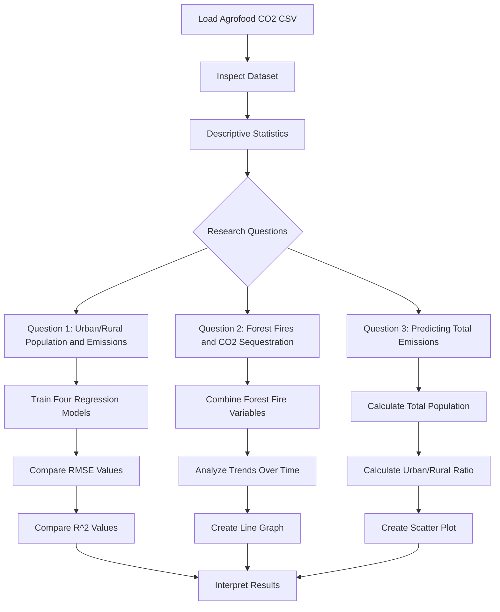

# IDS 706 Week 2 Assignment
[](https://github.com/BlueWolfpack/IDS706-Assignment-2/actions/workflows/python-app.yaml)  
This project is for the IDS 706 Data Engineering course Week 2 assignment, "Start Your First Data Analysis."

The dataset in [Agrofood_co2_emission.csv](Agrofood_co2_emission.csv) was downloaded from Kaggle on 8 September 2026. The analysis and notes are in [assignment_2_ntbk.ipynb](assignment_2_ntbk.ipynb). The executable version of the analysis is [assignment_2_ntbk.py](assignment_2_ntbk.py), which uses reusable functions from [fxns_for_ACE.py](fxns_for_ACE.py).

The analysis is organized into functions for data loading, preprocessing, feature engineering, model training and evaluation, and visualization. The script locates the main CSV relative to its own file, so it can be run from any working directory.

## Project Files
*This section was written with AI*
- [SETUP.md](SETUP.md): file with setup code
- [assignment_2_ntbk.ipynb](assignment_2_ntbk.ipynb): Notebook version of the analysis.
- [assignment_2_ntbk.py](assignment_2_ntbk.py): Script entry point with `main()`.
- [fxns_for_ACE.py](fxns_for_ACE.py): Reusable analysis functions.
- [tests.py](tests.py): Unit tests for dataframe and modeling functions.
- [test_cases.py](test_cases.py): Test cases to ensure functionality is preserved
- [test_system.py](test_system.py): End-to-end system test for the complete workflow.
- [Agrofood_co2_emission.csv](Agrofood_co2_emission.csv): Full analysis dataset.
- [Japan_Agrofood_co2_emission.csv](Japan_Agrofood_co2_emission.csv): Smaller fixture used in testing to reduce runtime.
- [test_fire.csv](test_fire.csv): Small csv to ensure that the test_fire function runs properly
- [Dockerfile](Dockerfile): Docker image set up. Test caes are run when container is opened. (*I think this is how it works*)

## Setup and Usage

Install the required packages in the Python environment selected by VS Code:

```bash
python -m pip install pandas matplotlib numpy scikit-learn
```

Run the full script from the project directory:

```bash
python assignment_2_ntbk.py
```

Run all unit and system tests:

```bash
python -m unittest discover -s . -p "test*.py" -v
```

The VS Code Testing view is configured to discover files matching `test*.py`, which includes both `tests.py` and `test_system.py`. The system test uses the smaller Japan fixture but still exercises the complete pipeline and suppresses interactive plot windows.

## Dataset Features

As of September 9, 2026, this dataset contains fewer than 7,000 entries.

**Savanna fires**: Emissions from fires in savanna ecosystems.  
**Forest fires**: Emissions from fires in forested areas.  
**Crop Residues**: Emissions from burning or decomposing leftover plant material after crop harvesting.  
**Rice Cultivation**: Emissions from methane released during rice cultivation.  
**Drained organic soils (CO2)**: Emissions from carbon dioxide released when draining organic soils.  
**Pesticides Manufacturing**: Emissions from the production of pesticides.  
**Food Transport**: Emissions from transporting food products.  
**Forestland**: Land covered by forests.  
**Net Forest conversion**: Change in forest area due to deforestation and afforestation.  
**Food Household Consumption**: Emissions from food consumption at the household level.  
**Food Retail**: Emissions from the operation of retail establishments selling food.  
**On-farm Electricity Use**: Electricity consumption on farms.  
**Food Packaging**: Emissions from the production and disposal of food packaging materials.  
**Agrifood Systems Waste Disposal**: Emissions from waste disposal in the agrifood system.  
**Food Processing**: Emissions from processing food products.  
**Fertilizers Manufacturing**: Emissions from the production of fertilizers.  
**IPPU**: Emissions from industrial processes and product use.  
**Manure applied to Soils**: Emissions from applying animal manure to agricultural soils.  
**Manure left on Pasture**: Emissions from animal manure on pasture or grazing land.  
**Manure Management**: Emissions from managing and treating animal manure.  
**Fires in organic soils**: Emissions from fires in organic soils.  
**Fires in humid tropical forests**: Emissions from fires in humid tropical forests.  
**On-farm energy use**: Energy consumption on farms.  
**Rural population**: Number of people living in rural areas.  
**Urban population**: Number of people living in urban areas.  
**Total Population - Male**: Total number of male individuals in the population.  
**Total Population - Female**: Total number of female individuals in the population.  
**total_emission**: Total greenhouse gas emissions from various sources.  
**Average Temperature (degrees C)**: The average annual temperature in degrees Celsius.

## Research Questions

1. **Did forest fires affect a forest's future ability to sequester CO2?**

   This question will examine **Forest fires** and **Fires in humid tropical forests** over time, along with changes in `total_emission`.

2. **Does the ratio of urban to rural populations affect total emissions?**

   I will normalize `total_emission` by the sum of the total male and total female populations. I will also compare rural and urban population counts with male and female population counts and discuss how any differences may affect the results.

3. **Which variable best predicts total emissions?**

   Four regression models are evaluated for each predictor and area: linear regression, degree-two polynomial regression, degree-three polynomial regression, and random forest regression. Models are compared using MAE, RMSE, and R-squared.


These three questions provide a reasonable starting point for the analysis.

## Analysis Plan

### Question 1: Did forest fires affect a forest's future ability to sequester CO2?

Sum `Forest fires` and `Fires in humid tropical forests` for the United States of America.  
Create a line graph to compare the shapes of the trends over time for designated areas.

My initial intention was to just do the USA, but I decided to also include Greece.

### Question 2: Does the ratio of urban to rural populations affect total emissions?

Sum `Total Population - Male` and `Total Population - Female`.
Divide `total_emission` by the population sum.
Divide `Urban population` by `Rural population`.
Create a scatter plot of population ratio versus normalized emissions.

### Question 3: Which variable best predicts total emissions?
A regression analysis for each `Area` and predictor runs four models and keeps the model with the lowest RMSE value.

The resulting dataframe is sorted by R-squared values in descending order to identify variables for further investigation. A high R-squared value does not establish causation and may result from overfitting.

*Note: I will not generate plots for this metric because it requires many comparisons.*

## Analysis Workflow


```mermaid
flowchart TD
   A[Load Agrofood CO2 CSV] --> B[Inspect Dataset]
   B --> C[Descriptive Statistics]

   C --> D{Research Questions}

   D --> Q1[Question 3: Predicting Total Emissions]
   D --> Q2[Question 2: Forest Fires and CO2 Sequestration]
   D --> Q3[Question 1: Urban/Rural Population and Emissions]

   Q3 --> Q3A[Train Four Regression Models]
   Q3A --> Q3B[Compare RMSE Values]
   Q3B --> Q3C[Compare R^2 Values]

   Q2 --> Q2A[Combine Forest Fire Variables]
   Q2A --> Q2B[Analyze Trends Over Time]
   Q2B --> Q2C[Create Line Graph]

   Q1 --> Q1A[Calculate Total Population]
   Q1A --> Q1B[Calculate Urban/Rural Ratio]
   Q1B --> Q1C[Create Scatter Plot]

   Q3C --> E[Interpret Results]
   Q2C --> E
   Q1C --> E
```
*mermaid chart generated using AI*

## Helpful Definitions

- **Afforestation**: An activity leading to the creation of forest on land that was not previously forested. [Source](https://www.sciencedirect.com/topics/earth-and-planetary-sciences/afforestation)
- **Crop residue**: The remains of crops left in the field after harvest. [Source](https://www.sciencedirect.com/topics/agricultural-and-biological-sciences/crop-residue)

*Diwas and AI assisted me in formatting the README.md file*

## Results - Discussion

### Question 1: Did forest fires affect a forest's future ability to sequester CO2?

There does not seem to be any meaningful impact of forest firest on co2 emissions. It is possible that there is a correlation, but that is difficult to discern from the graphs alone and further analysis would be required.

### Question 2: Does the ratio of urban to rural populations affect total emissions?

The data is not clear enough to determine an impact that the ratio may have on total emissions

###  Question 3: Which variable best predicts total emissions?

The best predictors of total emission for an area are: `Food Retail`, `Average Temperature`, `Total Population` (Male and Female), `Urban population`, `Food Transport`, and `Rural population` with counts \> 220

The worst predictors of total emission for an area are: `Fires in humid tropical forests` and `Fires in organic soils` with counts \<100

### Key Takeaway

I need different analyses to properly derive connections

## Testing
Screenshot that my testing worked

Screenshot taken 22 September 2026 at 21:04 EST

### Unit Testing Includes 
- test_new_df: This tests the ability to read a .csv and make a dataframe
- test_add_columns: Tests the ability to create a new dataframe with new column of None type
- test_create_fire_features: Tests the function to create a df with fire related columns and a new column with the sum of `Forest fires` and `Fires in tropical humid forests`.
- test_train_and_evaluate_models: Confirms the functionality of the machine learning modeling function

### System Testing
Runs a system test on the modified Japan_Agrofood_co2_emission.csv  
Using this dataframe reduces the time testing takes.

## Docker

Build the Docker image from the project directory:

```bash
docker build -t ids706-assignment-2 .
```

Run the analysis in a container:

```bash
docker run --rm ids706-assignment-2
```

The container runs `assignment_2_ntbk.py`, prints its results in the terminal, and is removed after it exits. Matplotlib uses a noninteractive backend in the container, so plots do not open in windows; the script does not save plot files.
The full dataset and model training can use substantial memory. If the container exits with status `137`, Docker or the host may have terminated it, often because of memory pressure. Increase the memory available to Docker or stop other running containers before trying again.

### Dockerfile


### Screenshots confirming image and container

[Screenshot of image on Docker](screenshots/docker_image.png)

[Screenshot of container on Docker](screenshots/docker_container.png)

[Screenshot of container terminal output](screenshots/docker_container_terminal_output.png)

### What I've learned about Docker

I believe that I have a decent understanding of the process/flow required to create an image and then a container. I have learned that you can have multiple containers open and have the option to close specified containers without changing the status of other open containers.

I am unsure why my bash command `docker run --rm ids706-assignment-2` did not seem to execute completely, but Docker Desktop showed a new container so I think it did?
> I figured it out. My model program takes several minutes to run, so that is why it seemed like it didn't execute completely. Maybe I should have it return something like `"Container is open"` before it starts executing other things.

## Refactoring

As part of my refactoring, I reformatted with Black Formatter.

I also went through some of the test files and test cases that I had AI develop for me and verified whether they were needed or not and made some changes to them. I don't have many screenshots of this as it was done before saving. 

[One instance of removing an unnecessary test between commits](screenshots/test_cases-refactoring.png)

Additionally, I had initially written my code all in one big chunk, but when instructed to do unit testing, I realized I needed to break my code up into various functions. I do not have a screenshot of the before code, but the current code is how it looks now. I made the `fxns_for_ACE.py` file which houses the functions used in `assignment_2_ntbk.ipynb`. 

The verification of the project's functionality was done by running the unit tests and, once those passed, running the system test.